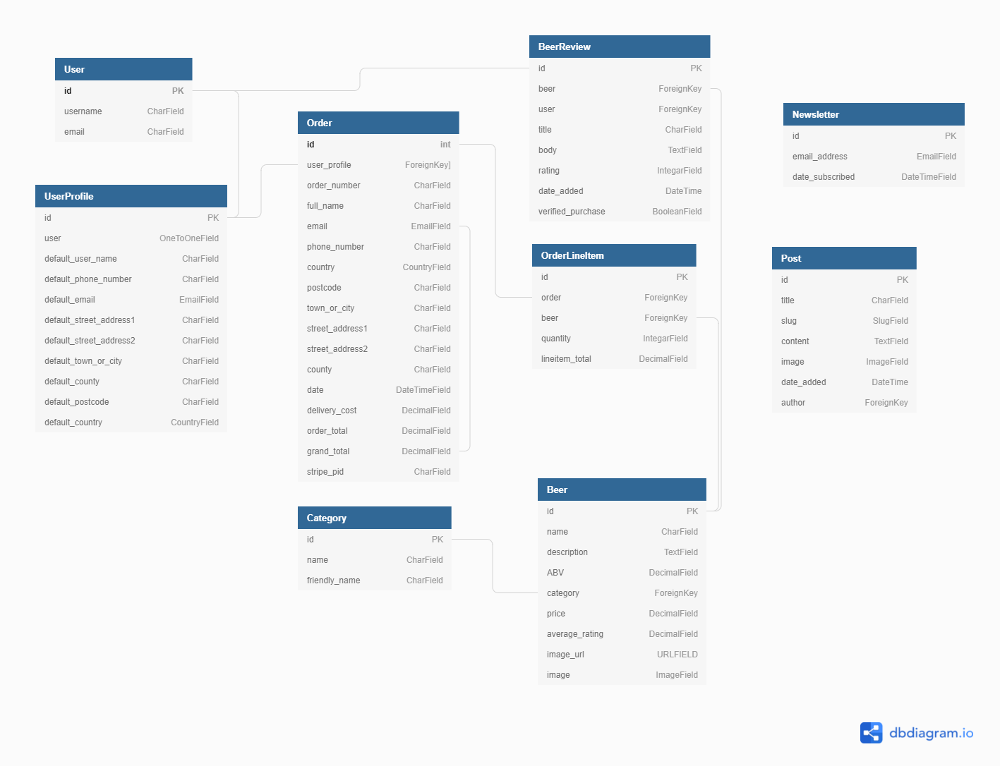

You can see the live website [here](https://farrelleoin93-12-acres.herokuapp.com/).


**To open any links in this document in a new tab press `CTRL + Click`.**

# UX
## Contents

---

- [UX](#ux)
  - [User Stories](#user-stories)
  - [Site Owner Goals](#goals)
  - [User Requirements and Expectations](#user-requirements)
  - [Design Choices](#design-choices)
    - Fonts
    - Icons
    - Colours
- [Database Model](#database-model)
- [Wireframes](#wireframes)
- [Features](#features)
- [Technologies](#technologies)
- [Testing](#testing)
- [Bugs](#bugs)
- [Deployment](#deployment)
- [Credits](#credits)
- [Acknowledgements](#acknowledgements)
- [Contact](#contact)

## <a name="ux">UX</a>

---

### <a name="user-stories">User Stories</a>

|      As a/an...      |                         I want the ability to...                         |                        So that I can...                       |
|:--------------------:|:------------------------------------------------------------------------:|:-------------------------------------------------------------:|
|                      |                                                                          |                                                               |
|          ---         |                                    ---                                   |                              ---                              |
| Unregistered user       | easily navigate the site                                                | find what I am looking for quickly                            |
| Unregistered user       | search for beers                                                     | quickly find beers that I am intrested in        |
| Unregistered user       | filter beers                                                | find specific types of beer                         |
| Unregistered user       | read details about each beer                                             | see if it is the type of beer that I want      |
| Unregistered user       | see what pubs and shops sell the beers              | have another way to buy them other than the website         |
| Unregistered user       | access contact details                                                  | get in touch with any questions                               |
| Unregistered user       | easily register an account                                      | use the site easier in the future                 |
|          ---         |                                    ---                                   |                              ---                              |
| Registered user      | log in and log out of my profile account                                | so that my personal information will be safe        |
| Registered user      | store my details for later use                                          | avoid having to fill in my details each time        |
| Registered user      | update my details                                                        | update address and other details in case they change          |
| Registered user      | store my order history                                               | access my previous orders                         |
| Registered user      | leave a review                                               | inform future users about the beer                         |
| Registered user      | review my purchase at the checkout                                  | decide whether to add or edit order before confirming     |
| Registered user      | Make secure payments                                                     | ensure my payments are securely handled                       |
| Registered user      | Receive email confirmation of my payment                        | confirm that my payment was made |
|          ---         |                                    ---                                   |                              ---                              |
| Site admin/superuser | add new beers to the website                                  | continuously make new beers available          |
| Site admin/superuser | update project listings                                                 | update new info from projects                                 |
| Site admin/superuser | delete existing project listings                                        | delete projects that may cease to exist                       |
| Site admin/superuser | create blogs                                                            | inform users about any developments at the company                          |
| Site admin/superuser | update blog entries                                                     | update users on any developments at the company                      |
| Site admin/superuser | delete blog entries                                                     | remove blog details           |
|                      |                                                                          |                                                               |


## <a name="user-requirements">User Requirements and Expectations</a>

---

- The user should be presented with a visually appealing website.
- The user should be able to clearly navigate through the website even on their first visit.
- The user should be able to read about each beer so that they can decide what beers are right for them.
- The user should be able search for a specific beer or filter the beer by a category.
- The user should be able to to find out informatiion about the comany via blog posts.
- The user should be able to register for the website.
- The user should be able to buy beers easily and securely. 
- The user should be able to safe their details to their profile and should also have the ability to edit them.
- The user should be able to contact the owners of the company.


## <a name="design-choices">Design Choices</a>

---

#### Fonts
- I had originally planned on using [Roboto](https://fonts.google.com/specimen/Roboto) as the font for this website but after some deliberation and feeedback from some friends that tested the website I decided to use [Poppins](https://fonts.google.com/?query=poppins) for all fonts on the page. I also decided to use a heavier version of [Poppins](https://fonts.google.com/?query=poppins) for the headings throughout the site.


### Colours
- I decided to use orange (#f9931e) for the navbar, footer and throughout the website, I chose this colour as I felt that it worked well the colour of the beer in the hero image.
- For most of the buttons on this s ite i used both bootstraps border-dark class and also a custom border-orange which uses the same orange (#f9931e) that is used throughout the site.
- The background of the website is also white.
- Any text that is on the orange background is white as I felt they worked well together.
- I chose black test to be used on any white background .

### Icons
- The icons that I used in this project were provided by [Font Awesome](https://fontawesome.com/). I decided to use icons as they offer a pleasant visual aide to the site, also users tend to know that icons usually work as buttons.

## <a name="database-model">Database Model</a>
I used a relational database for this project. During the development SQLite was used and then Heroku Postgres was used in production. The database can be seen in the diagram below



## <a name="wireframes">Wireframes</a>

---

The wireframes for this website can be found [here](wireframes/)


#### Changes to Wireframes

## <a name="features">Features</a>

---

#### Site-wide


**Responsive**

This site has been designed and made with all users in mind and tthus is visually appealing on desktops, tablets and mobile devices.


**Navbar**

The navbar is consistant on all pages throughout the website and adheres to common practices which users have come to expect from navbars, for example a dropdown appears on smaller devices. 

**Search bar**

The search bar finds beers that contain the word that the user searches for either in its name or description. Also the search term is displayed on the page along with the amount of beers containing the word submitted.

**Toasts**

Toasts appear on all pages providing the user with important information. These toasts also display the beers that the user might have in their shopping bag.

**Footer**

The footer contains information about 12 Acres such as their phone number and address. It also has a section where the user can sign up for a newsletter. 

#### Page-specific

**Home**

- The home page has a visually appealing hero image of pints of beer, this gives the user a strong hint as to what kind of website they have visited. It also has a welcoming message and a button that links the user to the beers page.
- The user can also find out a bit more about 12 Acres directly underneath the hero image by reading about how the beer is made and also by viewing images of the employees of 12 Acres.

**Beers**

- By default all beers are displayed on the beers page.
- The user can filter the beers by types of beer (ale, lager etc) by using the buttons at the top of the page.
- information about each beer is displayed in the form of cards. This information consists of an image, name, price and average rating.

**Beer details**

- The beer details pages conain the same information that is displayed in the cards on the beer page along with a description of the beer.
- A form allows the users to select how many bottles/cans they would like of the beer in question.
- Two buttons give the user the options to either add the beer to their bag or to return to the beers page.

  *Registered users*
- Have the ability to leave and edit reviews, but not to delete them.

  *Super users*
- Can both edit and delete a beer from the page.
- Can edit and delete any user's review.

**Bag**

- Allows line item quantities to be adjusted or removed from the bag and updates upon each change.
- Shows bag total, delivery and grand total of the order.
- If the bag total is less than the free delivery threshold, the amount required to receive free delivery is displayed.

**Checkout**

- Shows order summary and form to input delivery details.
- The payment is handled by Stripe and the reliability is improved by use of webhooks.

  *Registered users*
- If delivery details previously saved, form will be pre-populated with them.
- Option to save delivery details for future purchases.

**Checkout success**

Shows the contact info and delivery information as well as details of the order itself. On checkout the user is sent a confirmation email with details about their order.

**Profile page**

  *Registered users*
- Details:
  - default contact and delivery information.
  - ability to update to make future purchases easier.
- Orders:
  - view previous order details

**Add/edit beer**

  *Super users*
- Can add/edit a beer, choosing all of its required features.
- On submitting the addition/change, super user is redirected to the beers details page.

**Blog**

- All users are able to view any blogs that have been posted to the website.

  *Super users*
- Can add, edit and delete blogs.

**Blog**

- All users can contact the users via a form on the contact page.


**Secure accounts**
Account security is covered by Django's allauth.

**CRUD functionality**

All users can:
- View all beers

Registered users can:
- Create beer reviews
- Update beer reviews
- Update their delivery details

Superusers can:
- Frontend:
  - Create, Update and Delete beers
  - Create, Update and Delete any beer reviews

**Static and image file hosting**

Static and image files are served from an Amazon S3 Bucket.

**Access protection**

Routes are protected using Django's `@login_required` route decorators to ensure that non-super-users are not able to interfere with the database.

**404 and 500 error handling**
Pages for 404 and 500 errors keep the user on the site when something goes wrong, allowing them to return to the home page.

<span id="features-future"></span>

### Future
- Social network login/registration so that it is easy for users to access the site. This should lead to more people registering to the website.
- Apple / Google pay to improve checkout experience
- A merchandise section so that users can purchase items displaying the logo of their favourite beer.
## <a name="technologies">Technologies</a>

---

### Languages

- [HTML5](https://en.wikipedia.org/wiki/HTML5)
- [CSS3](https://en.wikipedia.org/wiki/CSS3)
- [JavaScript](https://en.wikipedia.org/wiki/javascript)
- [Python](https://en.wikipedia.org/wiki/Python_(programming_language))

### Other

1. [Tiny PNG](https://tinypng.com/)
   - This was used to compress the size of the hero image and the default card image.
2. [Font Awesome](https://fontawesome.com/)
   - The icons used were found at Font Awesome.
3. [Ucraft](https://www.ucraft.com/free-logo-maker)
   - Ucraft was used to make the logo for the favicon.
4. [Bootstrap](https://getbootstrap.com/)
   - Bootstrap was used throughout this website.
5. [jQuery](https://jquery.com/)
   - jQuery was used for initializing the Materialize features.
7. [Google Fonts](https://fonts.google.com/)
   - The fonts used for this website were found at Google Fonts.
8. [Balsamiq](https://balsamiq.com/)
   - The wireframes were made using Balsamiq.
9. [Github](https://github.com/)
   - This project was stored on Github.
10. [Gitpod](https://www.gitpod.io/)
    - Gitpod was used to write the code used for this website.
11. [Git](https://en.wikipedia.org/wiki/Git)
    - The version control system used for this project was Git.
12. [Chrome DevTools](https://developers.google.com/web/tools/chrome-devtools)
    - Chrome DevTools was used throughout the building of this website.
13. [WebFormatter](https://webformatter.com/html) 
    - WebFormatter was used to format the html and css files.
14. [Am I Responsive](http://ami.responsivedesign.is/) 
    - Am I Responsive was used to see how the website looked on different devices.
16. [Unsplash](https://unsplash.com/)
    - Unsplash was used to get images to use for the website.
17. [Pexels](https://www.pexels.com/)
    - Pexels was used to get images to use for the website.
18. [Emailjs](https://www.emailjs.com/)
    - Emailjs was used so that the user can sign up for the newsletter.
20. [JSHint](https://jshint.com/)
    - JSHint was used to test the JavaScript code.
21. [Python Tester](https://extendsclass.com/python-tester.html)
    - Used to test python code.
22. [Heroku](https://id.heroku.com/login)
    - Heroku was used to deploy this website


### Resources
The following websites were used as learning resources throughout the building of this project:
- [Code Institute](https://codeinstitute.net/)
- [Slack - Code Institutes Community](https://slack.com/intl/en-ie/)
- [w3schools](https://www.w3schools.com/)
- [Stack Overflow](https://stackoverflow.com/)
- [YouTube](https://www.youtube.com/)
- [CSS-Tricks](https://css-tricks.com/)
- [Markdown](https://commonmark.org/help/)

## <a name="testing">Testing</a>

---
The details of testing can be found [here](TESTING.md).

## <a name="bugs">Bugs</a>
changed 400.html to 

## <a name="deployment">Deployment</a>

---

The master branch of this repository is the most up to date version and has been used for the deployed version of the site.


<details>
<summary>How to clone 12 Acres and run locally</summary>
<p>

To clone this project from its [GitHub repository](https://github.com/farrelleoin93/12-acres-beer):
1. From the repository, click **Code**
2. In the **Clone >> HTTPS** section, copy the clone URL for the repository
3. In your local IDE open Git Bash
4. Change the current working directory to the location where you want the cloned directory to be made
5. Type `git clone`, and then paste the URL you copied in Step 2
```console
git clone https://github.com/farrelleoin93/12-acres-beer.git
```
6. Press Enter. Your local clone will be created
7. Create a file called `env.py` to hold your app's environment variables, which should contain the following:

```console
import os

os.environ.setdefault("SECRET_KEY", "<app secret key of your choice>")
os.environ.setdefault("DEVELOPMENT", "True")
os.environ.setdefault('STRIPE_PUBLIC_KEY', '<key generated by Stripe>')
os.environ.setdefault('STRIPE_SECRET_KEY', '<key generated by Stripe>')
os.environ.setdefault('STRIPE_WH_SECRET', '<key generated by Stripe for individual webhook endpoint>')
```
To find your Stripe keys, login to Stripe and then under the **Developers** tab look for the 'Publishable Key' and 'Secret Key'

The webhook secret key can be found under **Webhooks** once you have created an endpoint, which should be set to receive all events and match this url structure:
```
<your site's base url>/checkout/wh/
```
You will need a different endpoint for the local version and deployed site, updating the `STRIPE_WH_SECRET` accordingly in their respective environment variables.

8. **Make sure the following are listed in your .gitignore file to prevent any environment variables being pushed publicly:**
```
core.Microsoft*
core.mongo*
core.python*
env.py
__pycache__/
*.py[cod]
*.sqlite3
*.pyc
node_modules/
db.json
```
9. Install the app requirements using:
```
pip3 install requirements.txt
```
10. Apply database migrations using:
```
python manage.py migrate
```
11. Create a new superuser and fill in your details:
```
python manage.py createsuperuser
```
12. The app can now be run locally using
```
python manage.py runserver
```
</details>

<p>

<details>
<summary>How to deploy to Heroku</summary>
<p>

To deploy the app to Heroku from its [GitHub repository](https://github.com/farrelleoin93/12-acres-beer), the following steps were taken:
<!-- 1. **Commit** and **Push** the files to GitHub -->
2. **Log In** to [Heroku](https://id.heroku.com/login)
3. Select **Create new app** from the dropdown in the Heroku dashboard
4. Choose a unique name ('farrelleoin93-12-acres') for the app and the location nearest to you
5. Under **Resources** search for and add **Heroku Postgres** to your app
6. In your CLI install **dj_database_url** and **psycopg2** so that you can use Postgres on your deployed site
```
pip3 install dj_database_url
pip3 install psycopg2
```
7. Log into Heroku via the CLI
```
heroku login -i
```
8. Migrate the database into Postgres
```
heroku run python manage.py migrate
```
9. Create a new superuser and fill in your details:
```
python manage.py createsuperuser
```
10. Install gunicorn
```
pip3 install gunicorn
```
11. Freeze the app's requirements
```
pip3 freeze > requirements.txt
```
11. Create a file called **Procfile** and include the following, making sure not to leave a blank line after it:
```
web: gunicorn tweleveacres.wsgi:application
```
12. Disable Heroku's static file collection (temporarily)
```
heroku config:set DISABLE_COLLECTSTATIC=1 --app tweleveacres
```
13. Add the hostname of your Heroku app to settings.py
```
ALLOWED_HOSTS = ['farrelleoin93-12-acres.herokuapp.com', 'localhost']
```
14. Back in Heroku, select the **Deploy** tab and under **Deployment method** choose GitHub
15. In **Connect to GitHub** enter your GitHub repository details and once found, click **Connect**
16. Go to the **Settings** tab and under **Config Vars** choose **Reveal Config Vars**
17. Enter the following keys and values:

|**Key**|**Value**|
|:-----|:-----|
|AWS_ACCESS_KEY_ID|`<your variable here>`|
|AWS_SECRET_ACCESS_KEY|`<your variable here>`|
|DATABASE_URL|`<added by Heroku when Postgres installed>`|
|DISABLE_COLLECTSTATIC|`1` NB this variable will be deleted later|
|EMAIL_HOST_PASSWORD|`<your variable here>`|
|EMAIL_HOST_USER|`<your variable here>`|
|SECRET_KEY|`<your variable here>`|
|STRIPE_PUBLIC_KEY|`<your variable here>`|
|STRIPE_SECRET_KEY|`<your variable here>`|
|STRIPE_WH_SECRET|`<different from env.py>`|
|USE_AWS|True|

18. Go back to the **Deploy** tab and under **Automatic deploys** choose **Enable Automatic Deploys**
19. Back in your GitPod CLI add, commit and push your changes and Heroku will automatically deploy your app.
```
git add .
git commit -m "Initial commit"
git push
```
20. Your deployed site can be launched by clicking **Open App** from its page in Heroku.

</details>

<p>

<details>
<summary>Setting up an S3 Bucket</summary>
<p>

1. Create an [Amazon AWS](aws.amazon.com) account
2. Search for **S3** and create a new bucket
- Allow public access
- Acknowledge
3. Under **Properties > Static** website hosting
- Enable
- Index.html as index document
- Save
4. Under **Permissions > CORS** use:
```
		[
  {
      "AllowedHeaders": [
          "Authorization"
      ],
      "AllowedMethods": [
          "GET"
      ],
      "AllowedOrigins": [
          "*"
      ],
      "ExposeHeaders": []
  }
]
```
5. Under **Permissions > Bucket Policy**:
- Generate Bucket Policy and take note of **Bucket ARN**
- Chose **S3 Bucket Policy** as Type of Policy
- For **Principal**, enter `*`
- Enter **ARN** noted above
- **Add Statement**
- **Generate Policy**
- Copy **Policy JSON Document**
- Paste policy into **Edit Bucket policy**
- Save changes

6. Under **Access Control List (ACL)**:
- For **Everyone (public access)**, tick **List**
- Save changes

</details>
<p>
<details>
<summary>Setting up AWS IAM (Identity and Access Management)</summary>
<p>

1. From the **IAM dashboard** within AWS, select **User Groups**:
- Create new group e.g. `manage-12-acres`
- Click through to the end without adding a policy
- **Create Group**
2. Select **Policies**:
- Create policy
- Under **JSON** tab, click **Import managed policy**
- Choose **AmazongS3FullAccess**
- Edit the resource to include the **Bucket ARN**:
```
			"Resource": [
			                "arn:aws:s3:::farrelleoin93-12-acres",
			                "arn:aws:s3:::farrelleoin93-12-acres/*"
            ]
```
- Click **next step** and go to **Review policy**
- Give the policy a name e.g. `12-acres-policy` and description
- **Create policy**
3. Go back to **User Groups** and choose the group you created earlier
- Under **Permissions > Add permissions**, choose **Attach Policies** and select the policy that you just created
- **Add permissions**
4. Under **Users**:
- Choose a user name e.g. `12-acres-staticfiles-user`
- Select **Programmatic access** as the **Access type**
- Click Next
- Add the user to the Group you just created
- Click Next and **Create User**
5. **Download the `.csv` containing the access key and secret access key. Keep this safe as you will not be able to download it again**

</details>
<p>
<details>
<summary>Connecting Django up to S3</summary>
<p>

1. Install boto3 and django-storages
```
pip3 install boto3
pip3 install django-storages
pip3 freeze > requirements.txt
```
2. Add the values from the `.csv` you downloaded to your Heroku Convig vars in Settings:
```
AWS_ACCESS_KEY_ID
AWS_SECRET_ACCESS_KEY
```
3. Delete the `DISABLE_COLLECTSTATIC` variable from your Convig vars and deploy your Heroku app
4. With your S3 bucket now set up, you can create a new folder called `media` (at the same level as the `static` folder) and upload any required media files to it, making sure they are publicly accessible under **Permissions**

</details>


## <a name="credits">Credits</a>

---

### Credits for Fonts

- [Google Fonts](https://fonts.google.com)

### Media

- All images used on this website were found on [Unsplash](https://unsplash.com/) and [Pexels](https://www.pexels.com/).

### Code 


### Content

- 
## <a name="acknowledgements">Acknowledgements</a>

- I would like to thank mentor Akshat Garg for all his invaluable advice during my three mentor sessions.
- I would also like to thank the turors at Code Institute, in particular ....
for their help during this project.
- I would also like to thank thank Megan Lee, Kate Farrell, and Claire Shortall for testing my project and providing me with some feedback.


## <a name="contact">Contact</a>
If you have any questions regarding this project feel free to contact me at farrelleoin93@gmail.com.